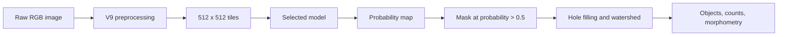

# CHANA

**Sequential domain-curriculum learning for osteoclast segmentation and morphometric quantification**

[](https://github.com/yuvipaloozie/CHANA/actions/workflows/ci.yml)

CHANA segments expert-defined osteoclast regions in TRAP-stained bright-field images. The repository includes six trained evaluation models, the TransUNet pseudo-label teacher, tiled inference from a microscopy image to a semantic mask and separated objects, the original training/data-generation exports, a cleared example, and the machine-readable manuscript results currently available.

> Research use only. CHANA has not been validated for clinical use, treatment decisions, or prospective drug screening.

## Quick start

Requirements: Git LFS, Python 3.10, and about 2.5 GB of free space for the checkpoints.

```bash
git lfs install
git clone https://github.com/yuvipaloozie/CHANA.git
cd CHANA
git lfs pull

conda env create -f environment/inference.yml
conda activate chana-inference
python -m pip install -e .
```

Verify the downloaded checkpoints:

```bash
python scripts/validate_checkpoints.py --weights-dir models --hash-only
```

Run the full inference pipeline on the included image:

```bash
python scripts/predict.py \
  --input sample_data/public_example/input_image.tif \
  --output-dir outputs/public_example \
  --model-id unetpp_curriculum \
  --weights-dir models
```

The command writes a foreground probability array, binary mask, watershed label image, and object-measurement CSV. Use any of the six model IDs below with the same command.

Compare the U-Net++ baseline and curriculum checkpoints on the cleared
image-mask pair:

```bash
python scripts/compare_models.py \
  --pairs-csv sample_data/public_example/pairs.csv \
  --output-dir outputs/unetpp_comparison \
  --weights-dir models \
  --save-predictions
```

The comparison verifies each checkpoint by SHA-256, runs the same image through
both registered model IDs, and writes per-image and summary CSVs containing IoU,
Dice, pixel average precision, HD95, object precision/recall/F1, and count error.
Use `--input-stage preprocessed` for images that already passed through V9.

## Models

| Model ID | Architecture | Training | Checkpoint |
|---|---|---|---|
| `unet_baseline` | U-Net / DenseNet121 | Expert-real only | `unet_baseline.weights.h5` |
| `unet_curriculum` | U-Net / DenseNet121 | Sequential curriculum | `unet_curriculum.weights.h5` |
| `unetpp_baseline` | U-Net++ / ResNet50 | Expert-real only | `unetpp_baseline.weights.h5` |
| `unetpp_curriculum` | U-Net++ / ResNet50 | Sequential curriculum | `unetpp_curriculum.weights.h5` |
| `transunet_baseline` | TransUNet / EfficientNetB0 | Expert-real only | `transunet_baseline.weights.h5` |
| `transunet_curriculum` | TransUNet / EfficientNetB0 | Sequential curriculum | `transunet_curriculum.weights.h5` |

The canonical names above correct reversed historical `Domain`/`no_Domain` filename labels. The exact file sizes and SHA-256 values are in [`manifests/model_registry.csv`](manifests/model_registry.csv).

`transunet_pseudolabel_teacher.weights.h5` is the fixed teacher used by the
pseudo-labelling export. It is not one of the six models compared in the final
evaluation tables.

## Pipeline



The curriculum trains each architecture through diffusion-derived, copy-paste, pseudo-labelled, and expert-labelled real domains. Baseline models use only the expert-real training set. Full settings and phase order are in [`docs/TRAINING.md`](docs/TRAINING.md).

## Training and data-generation code

The original Colab exports are under [`notebooks/legacy/python_exports/`](notebooks/legacy/python_exports/). They retain their original Drive paths, so set the input/output paths before running them.

| Task | Script |
|---|---|
| V9 RGB preprocessing | [`chana_preprocessing_rgb.py`](notebooks/legacy/python_exports/chana_preprocessing_rgb.py) |
| Diffusion-domain refinement | [`chana_diffusionv2.py`](notebooks/legacy/python_exports/chana_diffusionv2.py) |
| Copy-paste generation | [`chana_copy_paste_gen.py`](notebooks/legacy/python_exports/chana_copy_paste_gen.py) |
| Pseudo-labelling | [`chana_pseudo_labelling.py`](notebooks/legacy/python_exports/chana_pseudo_labelling.py) |
| U-Net baseline / curriculum | [`without domains`](notebooks/legacy/python_exports/chana_unet_without_domains.py) / [`with domains`](notebooks/legacy/python_exports/chana_unet_with_domains.py) |
| U-Net++ baseline / curriculum | [`without domains`](notebooks/legacy/python_exports/chana_unetpp_without_domains.py) / [`with domains`](notebooks/legacy/python_exports/chana_unetpp_with_domains.py) |
| TransUNet baseline / curriculum | [`without domains`](notebooks/legacy/python_exports/chana_transunet_without_domains.py) / [`with domains`](notebooks/legacy/python_exports/chana_transunet_with_domains.py) |

Reusable inference, preprocessing, postprocessing, model builders, and metrics are under [`src/chana/`](src/chana/). The two notebooks under [`notebooks/`](notebooks/) provide interactive entry points without embedded output images.

## Repository map

| Path | Contents |
|---|---|
| `src/chana/` | Reusable pipeline code |
| `scripts/` | Inference and validation commands |
| `models/` | Six evaluation checkpoints and the pseudo-label teacher (Git LFS) |
| `environment/` | Inference, training, and generation environments |
| `notebooks/` | Interactive notebooks and original Colab exports |
| `sample_data/` | Cleared input, mask, and example outputs |
| `manifests/` | Model registry and dataset/split schemas |
| `paper/` | Analysis exports, final table transcriptions, and available source data |
| `tests/` | Deterministic unit and data-integrity tests |

## Validate the repository

```bash
python -m pip install -e ".[test]"
python scripts/validate_manifests.py
python scripts/validate_source_data.py
python scripts/validate_sample_data.py --require-cleared
python -m pytest
```

## Manuscript data

The final Word documents control figure-panel selection and reported table values; publication figure binaries are not stored here. Their compact repository representation is under [`paper/final_assets/`](paper/final_assets/), and reusable values currently available are under [`paper/source_data/`](paper/source_data/).

Before the PLOS release, the repository still needs:

- the exact train/validation/test manifest with stable image and scan identifiers;
- the remaining per-image and per-object data behind the final figures and tables;
- the final license, release tag, and archive DOI.

The current split should be described only as a fixed 281-image random holdout until scan grouping is populated and checked. The included paper example is suitable for exercising file handling and postprocessing, but its supplied probability map is not an exact regression target for a registered checkpoint.

## Citation

Citation metadata are in [`CITATION.cff`](CITATION.cff). The DOI and software license will be added for the archival release.
