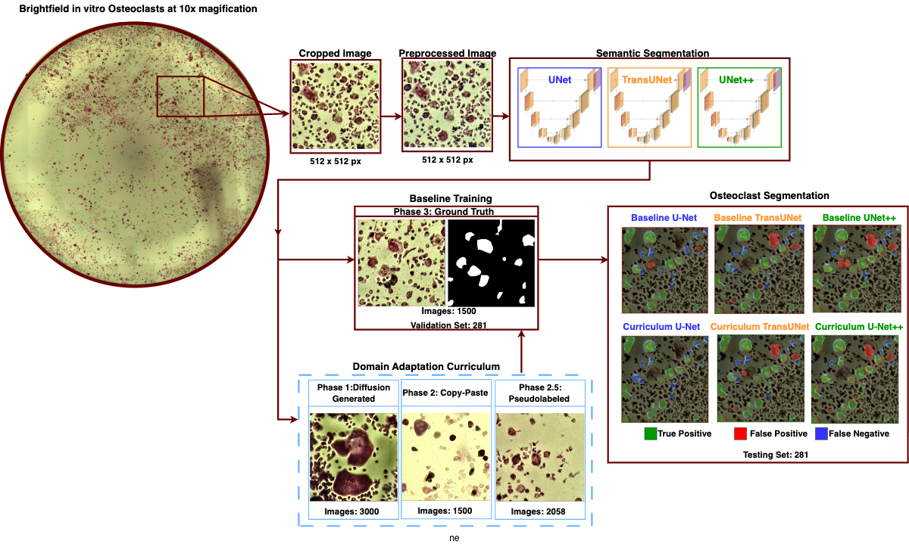

# CHANA

**Cell Histology Automated Neural Network Analyzer**

[](https://github.com/yuvipaloozie/CHANA/actions/workflows/ci.yml)


CHANA is a semantic-segmentation and morphometric-analysis workflow for
TRAP-stained bright-field osteoclast cultures. Manual delineation and counting
of mature osteoclasts is slow and observer-dependent, while expert-drawn masks
are expensive to produce. CHANA tests whether sequential training on
diffusion-derived, copy-paste, pseudo-labelled, and expert-labelled images can
improve performance when expert annotation is limited.

The repository compares U-Net, U-Net++, and TransUNet trained either on
expert-labelled images alone (baseline) or with the four-stage curriculum. It
includes six evaluation checkpoints, the pseudo-labelling teacher, preprocessing
and data-generation code, tiled inference through final masks and object
measurements, a cleared example, and the machine-readable results currently
available.

> Research use only. The results support technical feasibility for image
> segmentation and measurement; CHANA has not been validated for clinical use,
> treatment decisions, or prospective drug screening.

## Workflow



Bright-field images are preprocessed and tiled to 512 × 512 pixels. The six
registered models produce foreground probabilities, which are thresholded at
`> 0.5`; hole filling and watershed then separate touching regions for counts
and morphometry. The final overview panel is shown above. The reported
evaluation uses a fixed 281-image holdout, but the deposited records do not
establish scan-, well-, or biological-replicate independence.

## Condensed results

The values below are transcribed from the final main tables. Full confidence
intervals, definitions, all five main/supplementary tables, and direct CSV links
are in [`paper/README.md`](paper/README.md).

| Architecture | Training | Mean IoU | Mean Dice | Median finite HD95 (px) | Mean object F1 | Count MAE |
|---|---|---:|---:|---:|---:|---:|
| U-Net | Baseline | 0.607 | 0.741 | 71.09 | 0.783 | 2.49 |
| U-Net | Curriculum | 0.634 | 0.765 | 61.40 | 0.819 | 2.23 |
| U-Net++ | Baseline | 0.644 | 0.773 | 55.01 | 0.804 | 2.12 |
| **U-Net++** | **Curriculum** | **0.669** | **0.793** | **42.25** | **0.842** | **1.90** |
| TransUNet | Baseline | 0.603 | 0.740 | 64.10 | 0.769 | 2.32 |
| TransUNet | Curriculum | 0.623 | 0.757 | 61.63 | 0.777 | 2.26 |

All configurations were evaluated on the same 281 held-out image tiles. These
are manuscript summary values, not a substitute for the image-level data needed
to regenerate confidence intervals and plots.

## Quick start

Requirements: Git LFS, Python 3.10, and about 2.5 GB of free space for the
checkpoints.

```bash
git lfs install
git clone https://github.com/yuvipaloozie/CHANA.git
cd CHANA
git lfs pull

conda env create -f environment/inference.yml
conda activate chana-inference
python -m pip install -e .
python scripts/validate_checkpoints.py --weights-dir models --hash-only
```

Run the complete pipeline on the included image:

```bash
python scripts/predict.py \
  --input sample_data/public_example/input_image.tif \
  --output-dir outputs/public_example \
  --model-id unetpp_curriculum \
  --weights-dir models
```

The command writes the foreground probability array, binary mask, watershed
labels, and an object-measurement CSV.

Compare the U-Net++ baseline and curriculum checkpoints on the included
image-mask pair:

```bash
python scripts/compare_models.py \
  --pairs-csv sample_data/public_example/pairs.csv \
  --output-dir outputs/unetpp_comparison \
  --weights-dir models \
  --save-predictions
```

This verifies both checkpoint hashes and reports per-image and summary IoU,
Dice, pixel average precision, HD95, object precision/recall/F1, and count error.
Use `--input-stage preprocessed` for images that have already passed through V9.

## Registered models

| Model ID | Architecture | Training | Checkpoint |
|---|---|---|---|
| `unet_baseline` | U-Net / DenseNet121 | Expert-real only | `unet_baseline.weights.h5` |
| `unet_curriculum` | U-Net / DenseNet121 | Sequential curriculum | `unet_curriculum.weights.h5` |
| `unetpp_baseline` | U-Net++ / ResNet50 | Expert-real only | `unetpp_baseline.weights.h5` |
| `unetpp_curriculum` | U-Net++ / ResNet50 | Sequential curriculum | `unetpp_curriculum.weights.h5` |
| `transunet_baseline` | TransUNet / EfficientNetB0 | Expert-real only | `transunet_baseline.weights.h5` |
| `transunet_curriculum` | TransUNet / EfficientNetB0 | Sequential curriculum | `transunet_curriculum.weights.h5` |

The canonical names correct the reversed historical `Domain`/`no_Domain`
filenames. [`manifests/model_registry.csv`](manifests/model_registry.csv) is the
single authoritative mapping from semantic model ID to checkpoint filename,
legacy filename, size, and SHA-256. The separately registered
`transunet_pseudolabel_teacher.weights.h5` generated pseudo-labels and is not one
of the six final evaluation models.

## Training and data generation

The curriculum transfers weights through 3,000 diffusion-derived pairs, 1,500
copy-paste pairs, 2,058 pseudo-labelled real pairs, and final expert-real
training. Baselines use expert-real training only. Full settings and phase order
are in [`docs/TRAINING.md`](docs/TRAINING.md).

The original Colab exports remain under
[`notebooks/legacy/python_exports/`](notebooks/legacy/python_exports/). Set their
Drive input/output paths before running them.

| Task | Script |
|---|---|
| V9 RGB preprocessing | [`chana_preprocessing_rgb.py`](notebooks/legacy/python_exports/chana_preprocessing_rgb.py) |
| Diffusion-domain refinement | [`chana_diffusionv2.py`](notebooks/legacy/python_exports/chana_diffusionv2.py) |
| Copy-paste generation | [`chana_copy_paste_gen.py`](notebooks/legacy/python_exports/chana_copy_paste_gen.py) |
| Pseudo-labelling | [`chana_pseudo_labelling.py`](notebooks/legacy/python_exports/chana_pseudo_labelling.py) |
| U-Net baseline / curriculum | [`without domains`](notebooks/legacy/python_exports/chana_unet_without_domains.py) / [`with domains`](notebooks/legacy/python_exports/chana_unet_with_domains.py) |
| U-Net++ baseline / curriculum | [`without domains`](notebooks/legacy/python_exports/chana_unetpp_without_domains.py) / [`with domains`](notebooks/legacy/python_exports/chana_unetpp_with_domains.py) |
| TransUNet baseline / curriculum | [`without domains`](notebooks/legacy/python_exports/chana_transunet_without_domains.py) / [`with domains`](notebooks/legacy/python_exports/chana_transunet_with_domains.py) |

Reusable preprocessing, model builders, inference, postprocessing, and metrics
are under [`src/chana/`](src/chana/). The notebooks under [`notebooks/`](notebooks/)
provide interactive entry points without embedded manuscript figures.

## Repository guide

| Path | Contents |
|---|---|
| `src/chana/` | Reusable preprocessing, models, inference, metrics, and postprocessing |
| `scripts/` | Command-line inference, comparison, and validation |
| `models/` | Six evaluation checkpoints plus the pseudo-label teacher (Git LFS) |
| `environment/` | Pinned inference, training, and generation environments |
| `notebooks/` | Interactive notebooks and original Colab exports |
| `sample_data/` | Cleared example input, mask, and reference outputs |
| `manifests/model_registry.csv` | Canonical checkpoint identity and hashes |
| `paper/` | Figure 1, readable final tables, table CSVs, and available plot data |
| `tests/` | Deterministic unit and integrity tests |

## Validate the repository

```bash
python -m pip install -e ".[test]"
python scripts/validate_manifests.py
python scripts/validate_source_data.py
python scripts/validate_sample_data.py --require-cleared
python -m pytest
```

## Reproducibility scope

The repository currently supports environment creation, hash-checked model
selection, inference through object measurements, baseline/curriculum comparison,
training-script inspection, and validation of the deposited example and result
tables.

Before archival release, add the exact image-to-split mapping with stable image
and source-scan identifiers, plus the remaining machine-readable image/object
data behind the final plots and confidence intervals. Until that mapping is
available, describe the evaluation set only as a fixed 281-image holdout. Final
licensing, release tagging, and DOI archiving are separate release tasks.

## Citation

Citation metadata are in [`CITATION.cff`](CITATION.cff). The manuscript itself
is intentionally not linked from this repository at this stage.
